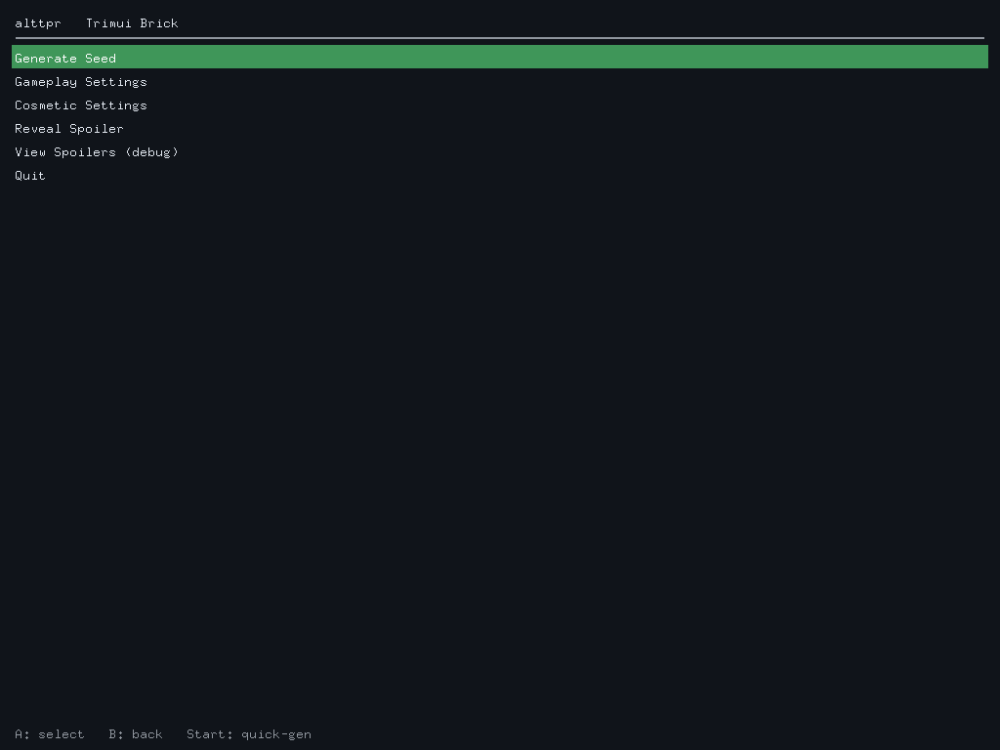
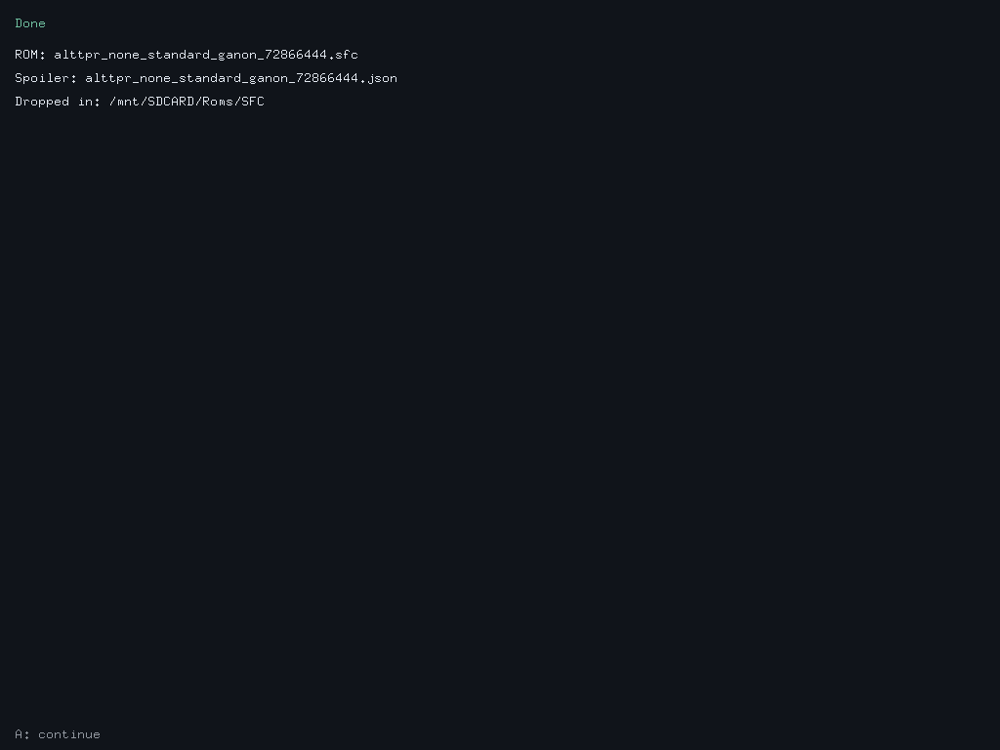
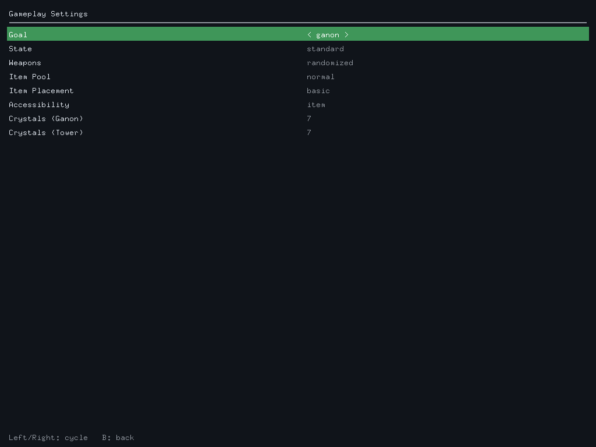
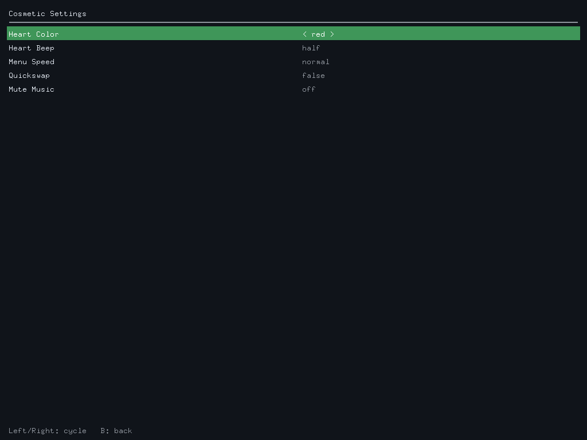
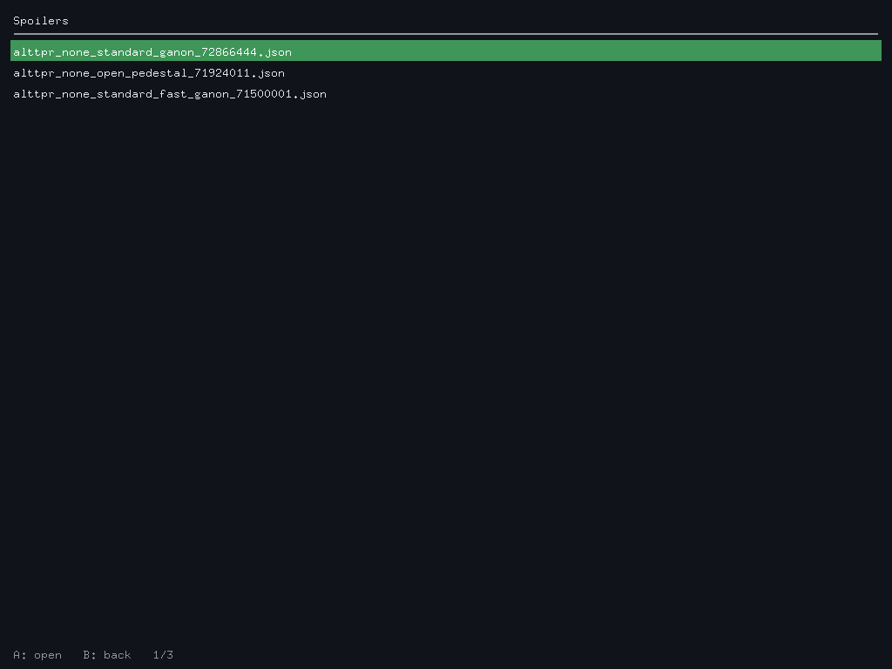
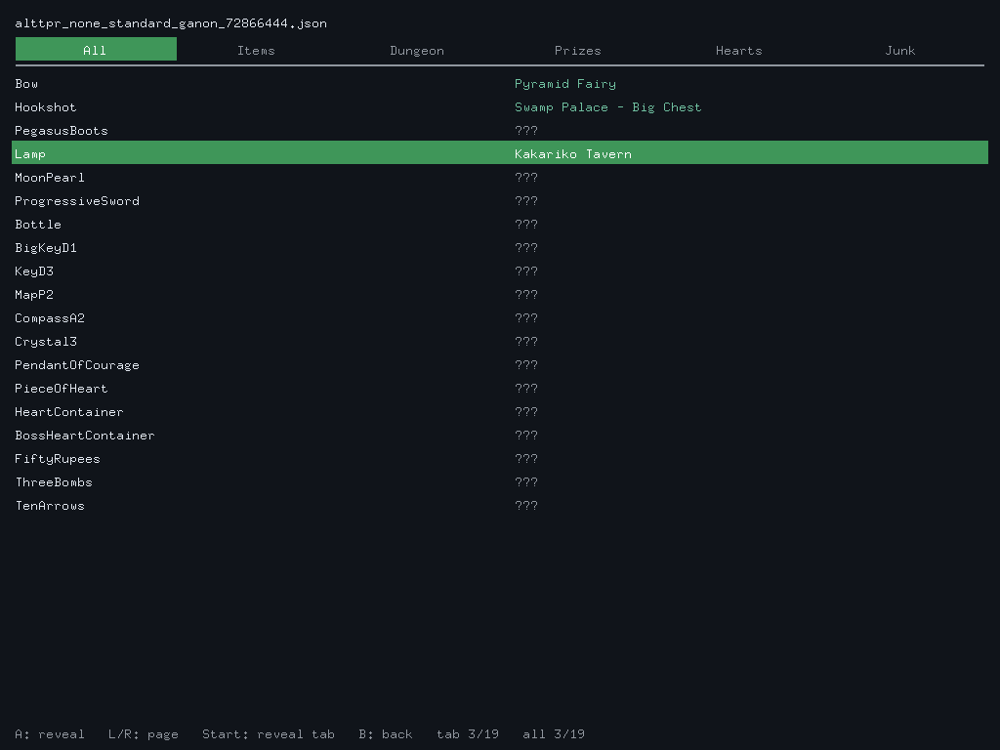
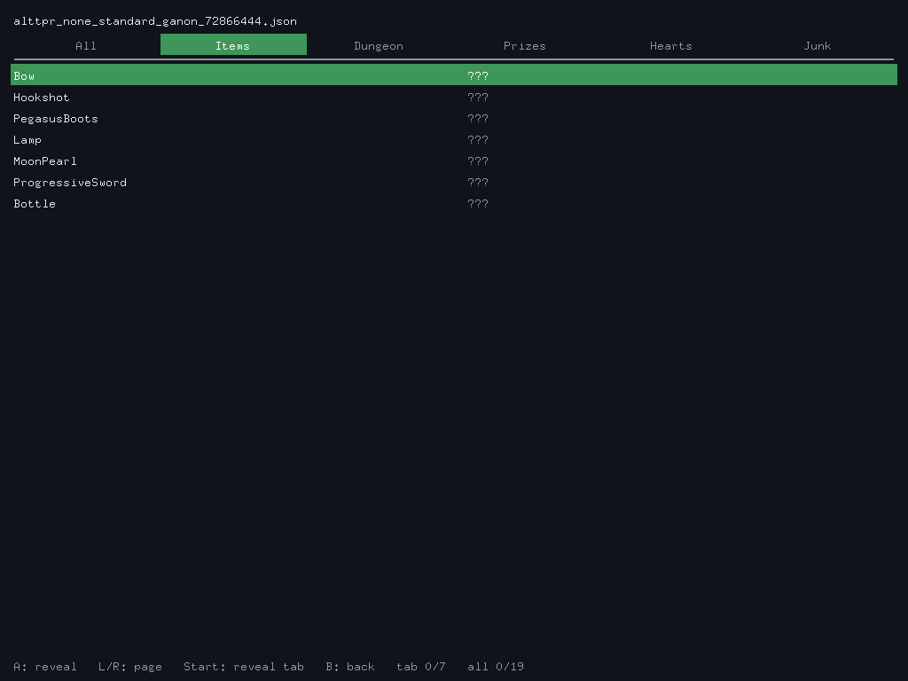
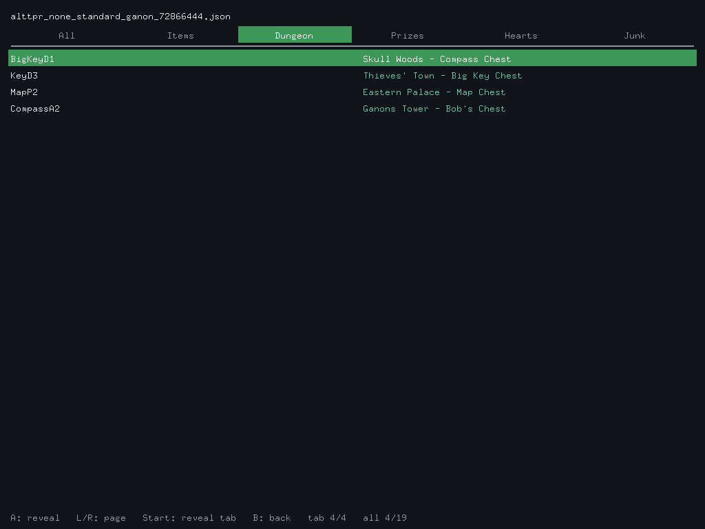

<h1>
  
  alttpr-brick
</h1>

On-device ALttP VT Randomizer harness for the Trimui Brick (stock OS,
arm64). One static Go binary: roll a fresh seed without leaving the
device, then dive into it on the built-in SNES core.

<p align="center">
  
</p>

## What it is

A second `cmd/` entry point alongside the desktop CLI (`cmd/alttpr`).
The brick binary embeds the base-patch JSON, draws a button-driven
menu directly to `/dev/fb0`, reads gamepad events from
`/dev/input/event*`, and calls the same `internal/job.Run` pipeline as
the desktop CLI. No subprocess, no SDL2, no CGO.

Architecture in one diagram:

```
+-----------------------+        +----------------------+
|  cmd/alttpr (desktop) |  -->   |                      |
+-----------------------+        |   internal/job.Run   |
+-----------------------+  -->   |  (open / patch / run |
|  cmd/alttpr-brick     |        |   / write / save)    |
|  fb + input + ui      |        +----------+-----------+
+-----------------------+                   |
                                            v
                                   internal/{world,rom,
                                   randomizer,patch,...}
```

Both binaries take the same `job.Options` (goal, state, weapons,
crystals, shuffle-prizes/crystals/pendants, cosmetics, ...), so adding
a knob is a one-time edit to `internal/job/job.go` and then exposing
it in whichever frontend cares.

## Build

```
scripts/build-brick.sh
```

Cross-compiles `linux/arm64`, stripped, no CGO. Output:
`dist/trimui-brick/alttpr-brick` (~4.4 MB; includes the 813 KB base
patch). The script also copies `launch.sh`, `settings.json.example`,
and `README.txt` into the same directory so the whole folder is
ready to drop on the SD card.

If you don't have the source patch yet, run
`php artisan alttp:updatebuildrecord` first to generate
`storage/patches/edc01f3db798ae4dfe21101311598d44.json`; the build
script auto-mirrors it into the embed directory.

## Install on the Brick

1. Copy `dist/trimui-brick/` to `/mnt/SDCARD/Apps/alttpr/`.
2. Drop your legally-owned ALttP base ROM at
   `/mnt/SDCARD/Apps/alttpr/base.sfc` (or point `base_rom` in
   `settings.json` elsewhere).
3. Reboot. Launch from Apps -> alttpr.

Generated ROMs land in `/mnt/SDCARD/Roms/SFC/` by default (configurable
via `output_dir` in `settings.json`) so they show up in the SNES game
list right away.

## Using it

The main menu has five entries:

- **Generate Seed** -- runs the randomizer with the currently selected
  options. Drops an `.sfc` + `.json` in the output directory and shows
  the filenames on the result screen.

  <p align="center">
    
  </p>

- **Gameplay Settings** -- Goal, State, Weapons, Item Pool,
  Item Placement, Accessibility, Crystals (Ganon), Crystals (Tower).
  Up/Down picks a row; Left/Right cycles the value.
- **Cosmetic Settings** -- Heart Color, Heart Beep, Menu Speed,
  Quickswap, Mute Music. Same row/value model.

  <table>
    <tr>
      <td></td>
      <td></td>
    </tr>
  </table>

- **Reveal Spoiler** -- pick a previously generated spoiler, then
  reveal locations one at a time. See below.
- **View Spoilers (debug)** -- raw scrollable JSON dump. Useful when
  something looks wrong; not the everyday viewer.

  <p align="center">
    
  </p>

Settings are persisted between launches in
`/mnt/SDCARD/Apps/alttpr/settings.json` (created on first save).

### Reveal mode

Each row shows an item name with the location hidden as `???`. Press
**A** to reveal where it was placed (or hide it again). The entries
are grouped into six tabs (All / Items / Dungeon / Prizes / Hearts /
Junk) so you can poke at one slice at a time -- for instance, peek at
just the junk locations to find that one Bombos in the rupee pool
without spoiling key items.

<p align="center">
  
</p>

Left/Right switches tabs; the highlighted band tracks which one is
active. Below: the same spoiler filtered to **Items**, and the
**Dungeon** tab after pressing Start (reveal-everything-in-tab).

<table>
  <tr>
    <td></td>
    <td></td>
  </tr>
</table>

The full tab list:

| Tab     | What's in it                                   |
|---------|-------------------------------------------------|
| All     | every item-location pair                       |
| Items   | progression gear (Hookshot, Bow, Boots, ...)   |
| Dungeon | Keys, Big Keys, Maps, Compasses                |
| Prizes  | Crystals + Pendants                            |
| Hearts  | Heart Container, Boss HC, Piece of Heart       |
| Junk    | rupees, bombs, arrows                          |

Controls:

| Button     | Action                                  |
|------------|------------------------------------------|
| Left/Right | switch tab (wraps)                      |
| Up/Down    | move cursor within tab                  |
| L/R        | page up/down (~24 rows)                 |
| A          | reveal/hide focused entry               |
| Start      | reveal everything in the current tab    |
| B          | back to file list                       |

Footer shows `tab N/M   all X/Y` so you always know how much you've
peeked at.

## settings.json

```json
{
  "base_rom": "/mnt/SDCARD/Apps/alttpr/base.sfc",
  "output_dir": "/mnt/SDCARD/Roms/SFC",
  "last_options": { ... full job.Options ... }
}
```

Any field can be omitted; missing values fall back to compiled-in
defaults. The harness rewrites the file after a successful generation
so your last menu choices stick.

## Troubleshooting

- **D-pad doesn't respond, buttons do.** Some gamepads report the
  D-pad on `EV_ABS` hat axes instead of `EV_KEY`; the harness handles
  both. If still no luck, uncomment `export INPUT_DEBUG=1` in
  `launch.sh`, exercise the buttons, exit, and inspect
  `input-debug.log` for the raw `type=/code=/value=` lines.
- **Buttons mapped wrong.** Edit `cmd/alttpr-brick/input/evdev.go`:
  `btnA`/`btnB`/`btnX`/`btnY` constants. The current values
  (305/304/308/307) are calibrated for the Brick.
- **Black screen at launch.** Set `TRIMUI_FB=/dev/fb1` in `launch.sh`
  if your firmware exposes the LCD on a different framebuffer.
- **"output directory not writable".** The SD card path doesn't exist
  or is read-only; create it once via the launcher's file browser or
  edit `output_dir` to a path you can write.
- **Flickering on input.** Shouldn't happen any more (double-buffered
  with a single `copy(fb, backbuf)` per frame). If it does, file an
  issue with what you're seeing.

## Layout

```
cmd/alttpr-brick/
  main.go             entry; settings.json + UI loop + spoiler IO
  config.go           load/save settings.json
  fb/                 framebuffer renderer (mmap'd /dev/fb0, BGRA32)
  input/              evdev reader (EV_KEY + EV_ABS hats)
  font/               pre-rasterized 8x16 glyph cache (basicfont)
  ui/                 pure-logic menu state machine + Renderer iface

internal/job/         shared job.Run pipeline (also used by desktop CLI)
internal/patch/       JSON base patch loader + //go:embed of the patch

dist/trimui-brick/    ready-to-copy app directory
scripts/build-brick.sh  one-shot cross-compile + assemble
```

The `ui` package is I/O-free and fully unit-tested (`go test
./cmd/alttpr-brick/...`); the fb / input / job code is exercised on
the device.
